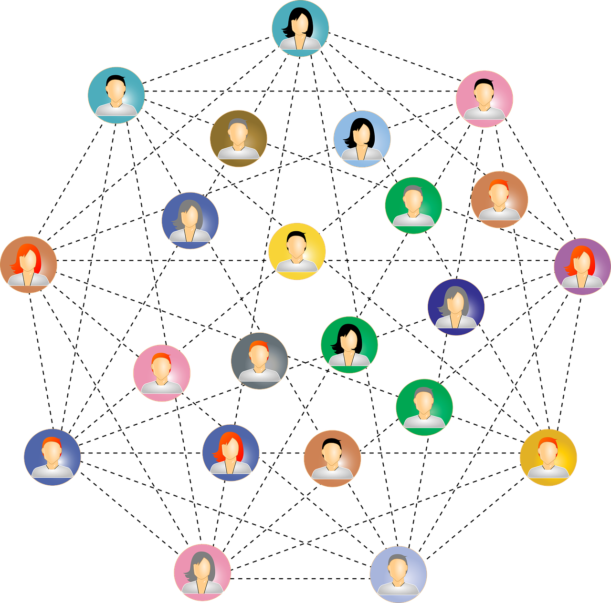

```{r, install remotely, globalsettings, echo=FALSE, warning=FALSE, results='hide', eval=FALSE}
install.packages("remotes")
remotes::install_github("rlesur/klippy")
```

```{r, globalsettings, echo=FALSE, warning=FALSE, results='hide'}
library(knitr)

knitr::opts_chunk$set(echo = TRUE)
opts_chunk$set(tidy.opts=list(width.cutoff=100),tidy=TRUE, warning = FALSE, message = FALSE,comment = "#>", cache=TRUE, class.source=c("test"), class.output=c("test2"))
options(width = 100)
rgl::setupKnitr()


colorize <- function(x, color) {sprintf("<span style='color: %s;'>%s</span>", color, x) }

```

```{r klippy, echo=FALSE, include=TRUE}
klippy::klippy(position = c('top', 'right'))
#klippy::klippy(color = 'darkred')
#klippy::klippy(tooltip_message = 'Click to copy', tooltip_success = 'Done')
```

------------------------------------------------------------------------

::: columns
::: {.column width="50%"}
# My Lab Journal

Last compiled on `r format(Sys.time(), '%B, %Y')`

\*\* <br>

------------------------------------------------------------------------


:::

::: {.column width="50%"}

:::
:::

## How to use this website
In the top menu, you can navigate through different parts of this project. In the journal, 
weekly tutorials will be uploaded. Parts of the final research will be posted under report.


